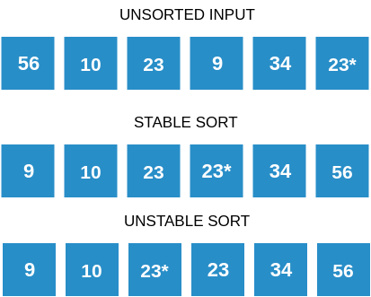

### What is a Comparison Sort Algorithm?

A Comparison Sort is a sorting algorithm where the final order is determined only by comparisons between the input elements.

In Radix Sort, the values of the elements are never compared. The elements are just placed into buckets according to the digit under consideration.

Hence, Radix Sort is not a comparison based sort.

### What is a Stable Sort Algorithm?

A sorting algorithm is said to be stable if two objects with equal keys appear in the same order in the sorted output as they appear in the input unsorted array. For example, look at the picture below. The unsorted array has two elements with value 23. Note the order of both these elements in the stable and unstable sorted arrays.

### Stable and Unstable sort

### Is Radix Sort stable?

Yes, radix sort is a stable sorting algorithm. Look at the picture below and keep an eye out for the ordering of 75 and **75***. Note how the original order of these elements is retained throughout the sorting process. The relative positioning of 75 and 75* does not change in the sorted output.

### Stability of Radixsort

