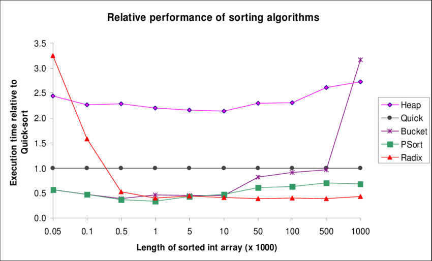

### Comparison of algorithms

### Comparison with other sorting algorithms

|Algorithm Sort 	|Algorithm Average |	Time Best |Time	Worst |Features	Space |Features	Stability|
|-----------------------|--------------------|-----------|------------|---------------|------------------|
|Radix sort 	|O(nk) 	O(nk) 	|O(nk) |	O(n+b) |	Stable|
|Bubble sort 	|O(n2) 	O(n2) |	O(n2) 	|Constant |	Stable|
|Modified Bubble sort |	O(n2) 	|O(n) 	O(n2) |	Constant |	Stable|
|Selection Sort 	|O(n2) |	O(n2) |	O(n2) |	Constant |	Stable|
|Insertion Sort 	|O(n2) |	O(n) |	O(n2) |	Constant |	Stable|
|Heap Sort 	|O(n*log(n)) 	|O(n*log(n)) |	O(n*log(n)) |	Constant |	Unstable|
|Merge Sort 	|O(n*log(n)) 	|O(n*log(n)) |	O(n*log(n)) |	Depends |	Stable|
|Quicksort 	|O(n*log(n)) 	|O(n*log(n)) |	O(n2) |	Constant 	|Stable|

### When is Radix sort actually used?

As we have seen, radix sort seems to have better time complexity than other sorting algorithms. Pertinent question is, why is it not as popular as the other algorithms? Here's why:

   - Radix sort only applies to integers, fixed size strings, floating points and to "less than", "greater than" or "lexicographic order" comparisons whereas comparison sorts can accommodate different orders.
   - k can be greater than log N, and when this happens comparison sorts become faster.
   - Popularly used comparison based sorting algorithms like quick sort can be done in place whereas radix sort is less efficient in terms of space complexity.

