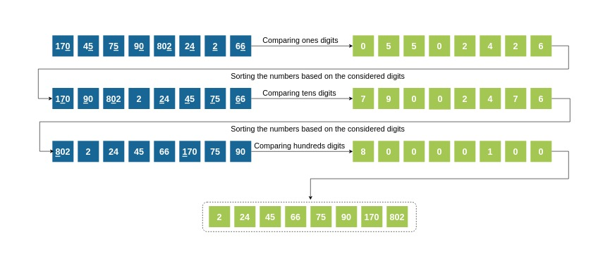
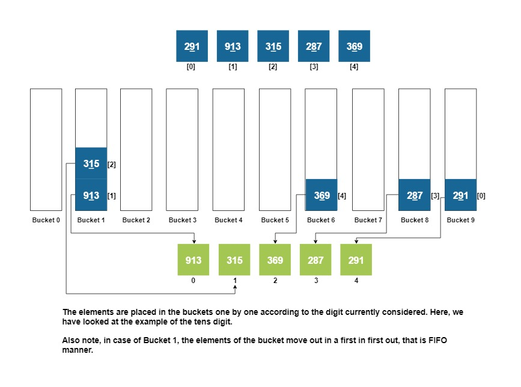

### The Radixsort Algorithm

   - In radix sort, we first sort the elements based on last digit (least significant digit/ units digit).
   - Then the resultant array is again sorted by the second last digit (tens digit).
   - This process is continued for all the digits in the same fashion until we finish doing the same for the most significant digit.
   - The resultant array obtained is a sorted array!

### Radix Sort steps

### Sorting using buckets

The sorting is done using containers(which hold numbers with same place/significant digit under consideration), as explained and shown using this example:
Suppose we are sorting: 291,913,315,287,369 according to the tens digit now(already sorted according to units)
We iterate over all elements and place them in their respective buckets:

bucket[0]-> empty 
bucket[1]-> 913, 315 
bucket[2]-> empty 
bucket[3]-> empty 
bucket[4]-> empty 
bucket[5]-> empty 
bucket[6]-> 369 
bucket[7]-> empty 
bucket[8]-> 287 

Now we remove all the elements from the buckets( in order from 0->9 ) and put them back in the array.

Within the same bucket, the element that came in earlier, goes out first( FIFO principle: First In First Out)

Array obtained as a result will be: 913, 315, 369, 287, 291.

**Refer to this image below for a better understanding.The initial array is at the top in blue and the final array in green, below the buckets.
Sorting using buckets**

### Sorting using buckets

### Radix Sort Video
<iframe src="https://www.youtube.com/embed/nu4gDuFabIM?start=4&end=52" frameborder="0" allow="autoplay; encrypted-media" allowfullscreen></iframe>
