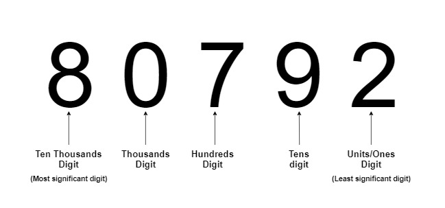

### Radix Concept and Algorithm
<iframe src="https://www.youtube.com/embed/gFNJdmC1Kis" frameborder="0" allow="autoplay; encrypted-media" allowfullscreen></iframe>

### Identifying the digits

### The Radixsort Concept

Radix sort is an integer sorting algorithm that sorts data with integer keys.
It works by grouping the keys according to individual digits that share the same significant position and value (place value), together into a container, which we usually call a **bucket**.
It then sorts e numbers in the order of placement in the buckets(least to highest).
**How does this work?** Lets take an example of this array : **34, 123, 233, 239, 287, 319**
Radix sort uses the observation that in a sorted array of numbers, the numbers are :

   - Firstly, sorted according to the most significant digit.
    **0**34, **1**23,**2**33, **2**39, **2**87, **3**19 
    The most significant digits(in bold) are in increasing order : **0,1,2,2,2,3**
   - Among the ones with the same most significant digit(or higher place value digit), they are arranged in the order of their second most significant digit(or next higher place value) and so on. 
    Among 2**3**3, 2**3**9, 2**8**7 (same hundred's digit : most significant digit),
    they are arranged in increasing order of the ten's digit (second most significant digit): **3,3,8**
   - Continuing till the last digit, 233 and 239 are also arranged in the order of their unit's digit(same hundred's and ten's digit):**3,9**

This is the basic concept that radix sort uses along with a method to sort the numbers based on particular place value (using buckets as told earlier in this section).

### Digit extraction

Have a look at the image above to understand what we mean by the "least significant digit" and the "most significant digit". To extract the digit at the ith position :

   - Divide the integer by 10(i-1) and take only the integral part.
   - Take the modulus of the resulting number with 10
   - Resulting number is your ith digit.

For example: 
Say 3rdrd least significant digit of 26438, that is the the hundred's position. 
First divide by 103-1 = 102 = 100. 
26438 / 100 = 264. 
Then take modulus with 10. 
264 % 10 = 4 
4 is the third least significant digit.

